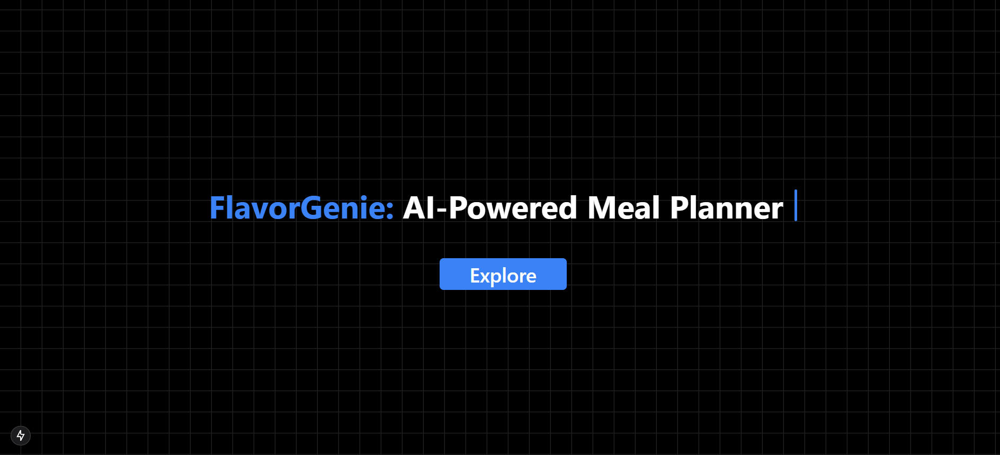

# **AI Recipe Generator with Bookmarks**  

## 🚀 Tech Stack  
- **Frontend:** Next.js 15, TypeScript, Tailwind CSS, ShadCN  
- **Backend:** API routes in Next.js (Groq API, Spoonacular API)  
- **Database:** Supabase (PostgreSQL)  
- **Auth:** Supabase Auth  
- **State Management:** useState, useEffect  

## ✨ Features  
✅ **Generate Recipes:** Enter ingredients and get AI-generated dish suggestions by using Groq API.
✅ **View Detailed Recipes:** Click on a dish to fetch step-by-step recipes from Spoonacular.  
✅ **Bookmark Recipes:** Save favorite recipes with a single click.  
✅ **Supabase Integration:** Store and manage bookmarked recipes in a database.  
✅ **User Authentication:** Secure login using Supabase Auth.  
✅ **Responsive UI:** Beautiful UI built with Tailwind and ShadCN components.  




## 📦 Setup & Installation  

### 1️⃣ Clone the Repo  
```bash
git clone https://github.com/anushatomar13/recipeAI-app.git
cd ai-recipe-generator
